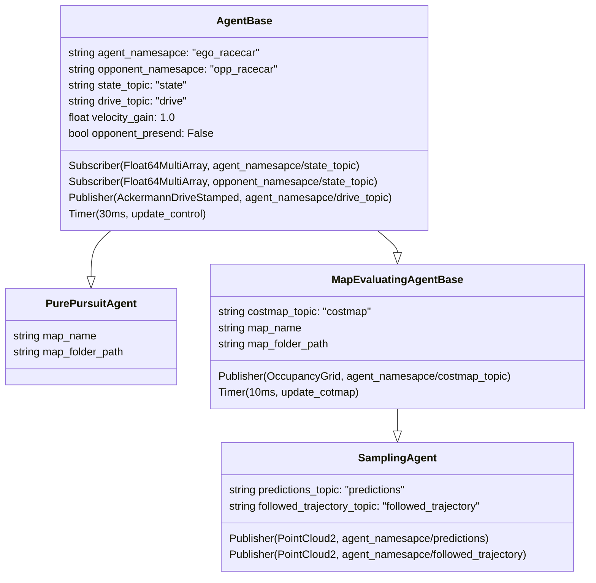

# F1Tenth Workspace

## Struktura tříd

## Using via Dev Containers
- start by installing WSL: `wsl --install`
- install [Docker Destkop](https://www.docker.com/products/docker-desktop/): `winget install Docker.DockerDesktop` (needs reboot after install + setup in GUI)
- install [Dev Containers](vscode:extension/ms-vscode-remote.remote-containers) extension in VS Code
- if you already have this folder opened in code then `Ctrl + Shift + P` and `Dev Containers: Reopen folder in container` or `Dev Containers: Open Folder in Container`
- once container is built test running project with `Ctrl + Shift + B`

## Poznámky
### Obecné
- Při rozjezdu na začátku omezit zatáčení (rozjíždět se jenom rovně)
- Není synchronizovaná mapa v simulátoru s launch.py
- zpomalit cas (vlastni publisher na cas), nebo nahrat rosbag a prehravat zpomalene

### Samplování
- Používání klotoid
- zlepsit limity pro generovani samplu

### Simulace controls
- Zkusit více modelů (Ackermann kinematic model)

### Evaluace
- Vyladit jezdeni bez oponenta
- pridat orientaci auta do vyhodnoceni
- napocitat vektory s orientaci
- odladit na centerline
